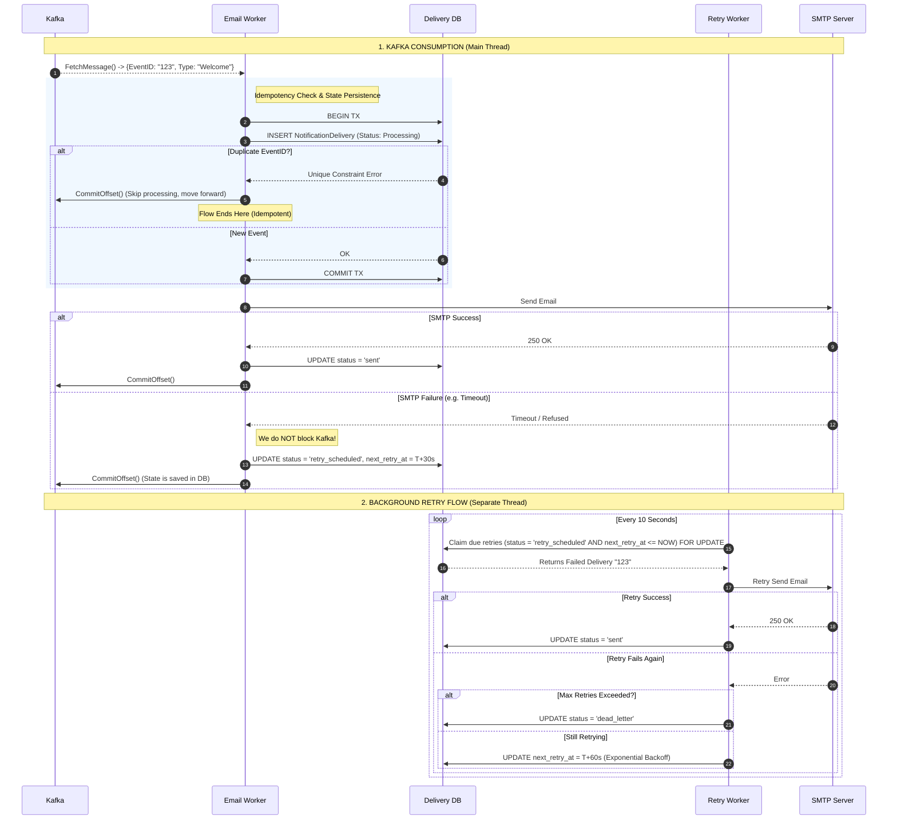

# Email Processing & Retry Flow

This sequence diagram details how the Notification Service ensures at-least-once delivery, idempotency, and background retries when interacting with Kafka and SMTP.

